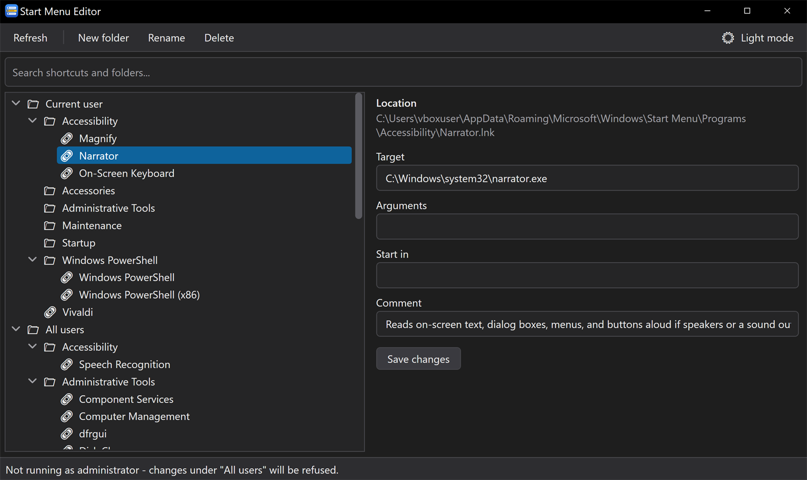
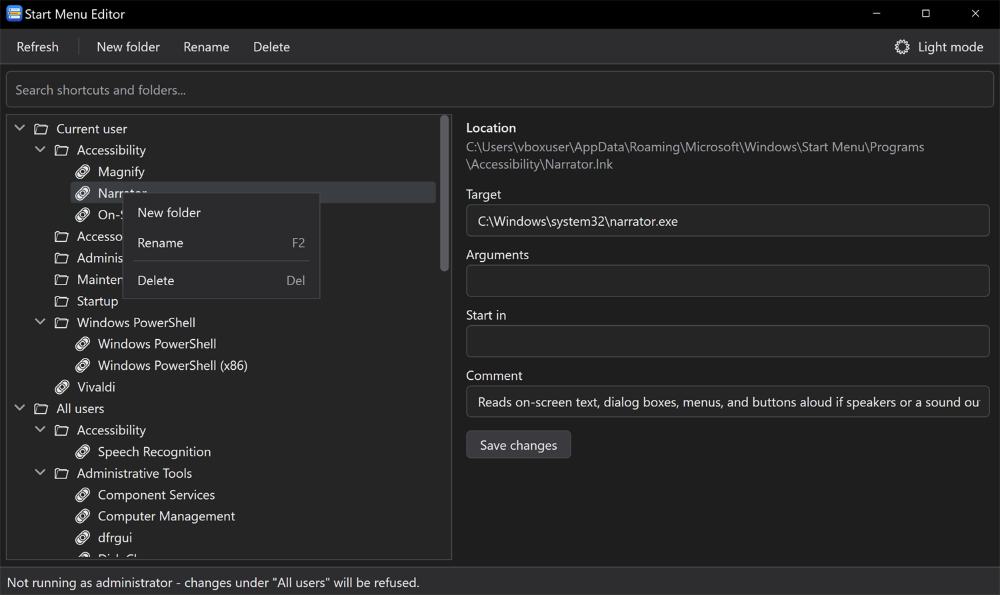
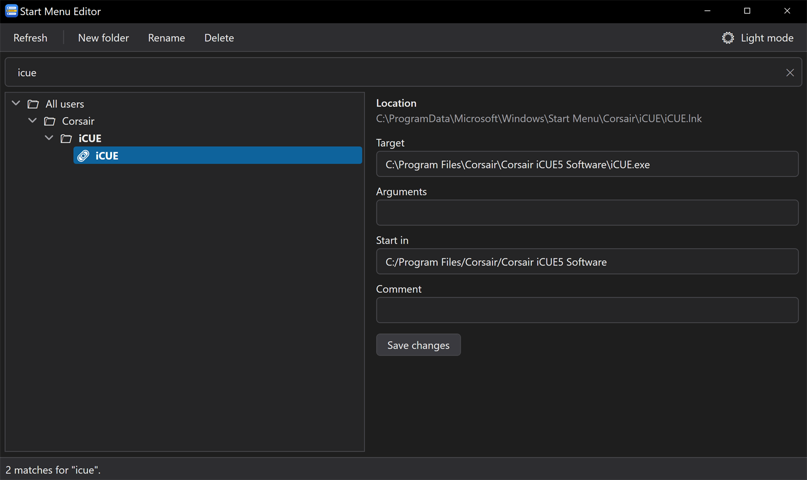
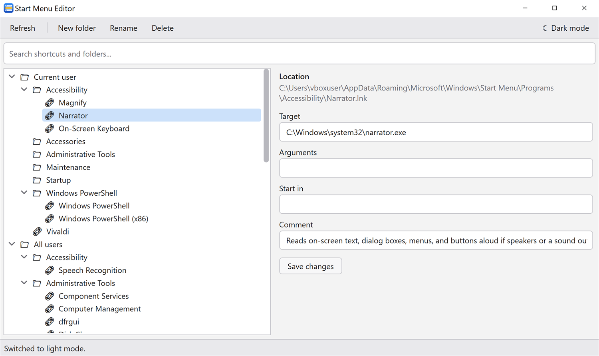

# Start Menu Editor

A small WPF app for tidying the **All apps** list of the Windows 10 Start menu. It works directly on the shortcut files Windows builds that list from, so changes show up in the Start menu without restarting anything.

> **Scope:** shortcuts and folders only. Editing Start **tiles** (pinned layout) is deliberately not supported.



## Download

Get the latest build from the [latest release](https://github.com/harlyvibes/Win10-StartMenuEditor/releases/latest) - download `StartMenuEditor-<version>-win-x64.exe` and run it. It is a small single file for 64-bit Windows 10 or later that uses the .NET runtime already on your machine, so you need the **.NET 8 Desktop Runtime (x64)** installed. If it is missing, Windows will offer a link to install it, or get it from the [.NET 8 download page](https://dotnet.microsoft.com/download/dotnet/8.0). The SHA-256 checksum is listed in each release's notes.

Releases up to v0.1.2 were self-contained (about 68 MB) and did not need the runtime.

The exe is not code-signed, so Windows SmartScreen may show a warning the first time you run it. Choose **More info** > **Run anyway** if you trust the download.

## Features

- Browse both Start menu roots in one tree:
  - **Current user** - `%AppData%\Microsoft\Windows\Start Menu\Programs`
  - **All users** - `%ProgramData%\Microsoft\Windows\Start Menu\Programs`
- Each root also shows entries that installers place directly in the `Start Menu` folder next to `Programs` (for example Corsair's `iCUE`), merged into one list the way Windows shows them. Selecting an entry shows its real location. New folders are created inside `Programs`.
- Search box at the top of the window (`Ctrl+F` to focus, `Esc` to clear): the tree filters as you type, matches are shown in bold, and a matching folder shows everything inside it.
- Right-click any entry for **New folder**, **Rename** and **Delete**. `F2` renames and `Del` deletes the selected entry.
- Dark and light themes. Dark is the default; the button at the top right switches, and your choice is remembered in `%AppData%\StartMenuEditor\settings.json`.
- Create, rename and delete folders and shortcuts. Deletes go to the Recycle Bin, so they can be undone.
- Drag and drop a shortcut or folder into another folder to move it.
- Edit a `.lnk` shortcut's target, arguments, start-in folder and comment. Only fields you change are written back, so shortcuts that point at special shell items are left intact.

## Screenshots

**Right-click menu** - New folder, Rename and Delete on any entry, with `F2` and `Del` as shortcuts:



**Search** - filters as you type and finds entries wherever they live, including ones an installer placed directly in the `Start Menu` folder, like Corsair's iCUE:



**Light mode** - dark is the default, and one click switches:



## Limitations

- Changes under **All users** need the editor to be run as administrator. The status bar shows whether it is elevated.
- `.url` and `.appref-ms` shortcuts are listed but read-only.
- Microsoft Store / UWP apps don't have a `.lnk` in these folders (they live in `shell:AppsFolder`), so they can't be edited.
- Start tiles and pinned layout are out of scope.

## Requirements

- Windows 10 or later (64-bit)
- To run: the [.NET 8 Desktop Runtime](https://dotnet.microsoft.com/download/dotnet/8.0) (x64)
- To build: the [.NET 8 SDK](https://dotnet.microsoft.com/download/dotnet/8.0)

## Build and run

```powershell
dotnet build
dotnet run
```

To edit the **All users** list, start the app from an elevated terminal (or right-click the built `StartMenuEditor.exe` and choose *Run as administrator*).

To produce a release build (framework-dependent, so it does not bundle the .NET runtime):

```powershell
dotnet publish -c Release -r win-x64 --self-contained false -p:PublishSingleFile=true
```

## Project layout

| Path | Purpose |
|---|---|
| `MainWindow.xaml(.cs)` | Tree view, toolbar, details panel and drag-and-drop |
| `Prompt.cs`, `Dialogs.cs` | Small modal dialogs, drawn by the app so they follow the theme |
| `Themes/` | `DarkTheme.xaml` and `LightTheme.xaml` (colours only) and `Controls.xaml` (control styles that use them) |
| `Services/ThemeService.cs`, `Services/ThemeSettings.cs` | Swaps the theme at runtime and saves the choice |
| `Models/StartMenuNode.cs` | Tree node for a root, folder or shortcut |
| `Services/StartMenuService.cs` | Loads the folders and performs rename, delete, create and move |
| `Services/ShellLink.cs` | Reads and writes `.lnk` files through the shell's `IShellLink` COM interface |
| `docs/screenshots/` | The images used in this README |

## Tests

```powershell
dotnet test tests\StartMenuEditor.Tests
```

The xUnit tests run the service operations (load, rename, create folder, move, delete) against a temporary folder, and round-trip real `.lnk` files through the `ShellLink` wrapper. They also cover the search filter, the merged `Programs` plus `Start Menu` view, and saving the theme choice. They never touch your actual Start menu. The two delete tests send a tiny temp item to the Recycle Bin each, since that is what the app does.

## Status

The project builds, starts, and its service layer is covered by the automated tests above. The WPF interface itself (dialogs, drag and drop) has not been tested automatically, so try changes on a throwaway folder in the **Current user** root first.
